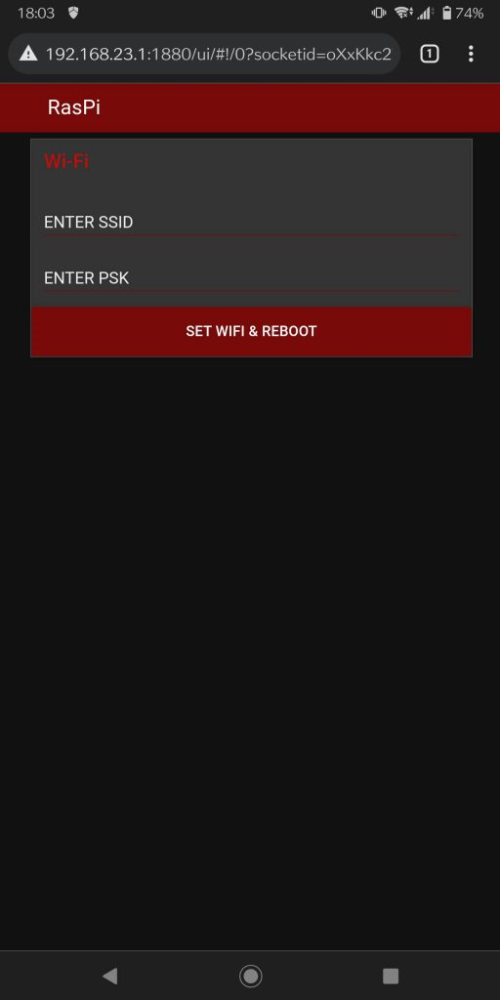
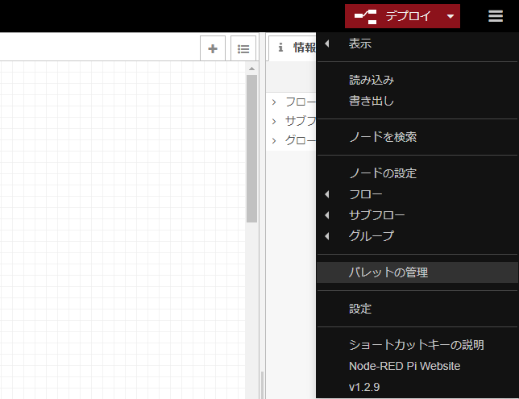
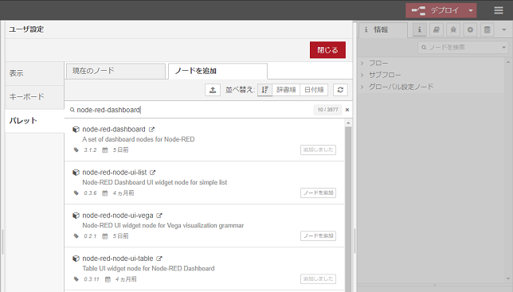

# スマートフォンから Raspberry Pi の Wi-Fi を設定する（WiFiアダプタ不要）

WiFiに自動接続できなかった際に Raspberry Pi を自動でAPモードに移行し、接続してきた子機に対して設定画面を表示することで、煩わしいLANケーブルや、モニタ、マウスなど追加デバイスを物理的に繋ぐことなくWiFiの設定を出来るようにする。

スマートフォンからの動作デモ画面  


# Requirement
* Node-RED
    * node-red-dashboard
* hostapd
* isc-dhcp-server

# Installation

## Node-RED
※RaspbianのFullVersionを使用しているなら初期インストール済なので不要
```bash
$ bash <(curl -sL https://raw.githubusercontent.com/node-red/linux-installers/master/deb/update-nodejs-and-nodered)
```

## node-red-dashboard
Node-REDの起動後、任意のブラウザで http://<Piのアドレス>:1880 にアクセス<br>
以下のようにノードの追加を行う。



## hostapd
インストールと、自動起動オフ設定
```bash
$ sudo apt-get install hostapd
$ sudo systemctl disable hostapd
```

confファイルを編集

テンプレートは以下 ssid/wpa_passphrase は変更必須。  
<>←は必要なし。ex)ssid=rasPi_Wifi

/etc/hostapd/hostapd.conf
```
interface=wlan0
driver=nl80211
ssid=<設定したいSSID>
hw_mode=g
channel=6
ieee80211n=1
wmm_enabled=1
ht_capab=[HT40][SHORT-GI-20][DSSS_CCK-40]
macaddr_acl=0
auth_algs=1
ignore_broadcast_ssid=0
wpa=2
wpa_key_mgmt=WPA-PSK
wpa_passphrase=<設定したいPASSWORD>
rsn_pairwise=CCMP
```

## isc-dhcp-server
インストールと、自動起動オフ設定
```bash
$ sudo apt-get install isc-dhcp-server
$ sudo systemctl disable isc-dhcp-server
```
インターフェイス設定（Piの無線LANインターフェイスを指定）  
/etc/default/isc-dhcp-server
```
INTERFACESv4="wlan0"
INTERFACESv6="wlan0"
```

confファイルを編集

domain-nameをコメントアウト

/etc/dhcp/dhcpd.conf
```
option domain-name "example.org";
option domain-name-servers ns1.example.org, ns2.example.org;
↓
#option domain-name "example.org";
#option domain-name-servers ns1.example.org, ns2.example.org;
```
authoritativeのコメントアウトを外して有効にする

/etc/dhcp/dhcpd.conf
```
# If this DHCP server is the official DHCP server for the local
# network, the authoritative directive should be uncommented.
#authoritative;
↓
authoritative;
```

最終行に以下追加  
※Piの固定アドレスを192.168.23.1、割当範囲を192.168.23.10~192.168.23.100に設定  
/etc/dhcp/dhcpd.conf
```
subnet 192.168.23.0 netmask 255.255.255.0{
    range 192.168.23.10 192.168.23.100;
    option broadcast-address 192.168.23.255;
}
```

## インターフェイス設定
APモード用とSTAモード用のそれぞれの設定ファイルを作成。
``` bash
$ sudo cp /etc/dhcpcd.conf /etc/dhcpcd.conf.ap
$ sudo cp /etc/dhcpcd.conf /etc/dhcpcd.conf.sta
$ sudo cp /etc/network/interfaces /etc/network/interfaces.sta
$ sudo cp /etc/network/interfaces /etc/network/interfaces.ap
```

/etc/dhcpcd.conf.ap
``` bash
interface wlan0
static ip_address=192.168.23.1/24
static routers=192.168.23.1
static domain_name_servers=192.168.23.1
static broadcast 192.168.23.255
nohook wpa_supplicant
```

元の設定をコメント化  
/etc/network/interfaces.ap
``` bash
source /etc/network/interfaces.d/*
↓
#source /etc/network/interfaces.d/*
```
最終行に以下を追加  
/etc/network/interfaces.ap
``` bash
iface wlan0 inet static
address 192.168.23.1
netmask 255.255.255.0
```
# Usage

Node-REDの起動、任意のブラウザで http://<Piのアドレス>:1880 にアクセス  
右上のハンバーガーメニューから

"auto-ap-sta_wifi_setting_flows.json"

を読み込んでデプロイ  
http://<Piのアドレス>:1880/ui を確認して表示ができればセットアップ完了。  

Raspberry PiがWi-Fiに自動接続できなかった場合に、  
hostaptとisc-dhcp-serverが自動起動。  

スマホ等からhostapd.confに設定したSSIDに繋いだ後、  
http://192.168.1.23:1880/ui/ にアクセスすると設定画面が表示される。  

設定画面にSSIDとPSKを入力、SET WIFI & REBOOTボタン押下でRaspberryPiの再起動後、設定したWiFiに自動接続される。